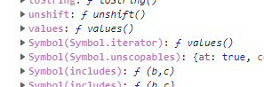

오늘은 이터러블에 대해서 알아보려고 한다.

# 이터러블이란?

이터러블 프로토콜을 준수한 객체를 이터러블이라고 한다.

```
💡 이터러블 프로토콜이란?

javasciprt에서 기본 제공하는 빌트인 심벌 값인 Symbol.iterator를 프로퍼티 키로 사용한 메서드를

직접 구현하거나 Symbol.iterator를 호출하면 이터레이터를 반환하는 것이다.

쉽게 말하면 for of 메서드로 순회 가능한 객체인것이다.
```

`String`, `Array`, `문자열`, `Map`, `Set` 등은 이터러블이다.

전에 올렸던 `Map`, `Set`에서 말했던 것 처럼 for of문으로 순회 할 수 있고, 스프레드 문법과

디스트럭처링 할당을 할 수 있다.

예제 코드 👇

```javascript
let arr = [1,2,3];

for(const item of arr){
    console.log(item);  // result: 1
                        //         2
                        //         3
}

console.log([...arr]); // result : [1, 2, 3]
console.log(...arr); // result : 1 2 3
```

어떤 객체가 이터러블인지 아닌지 확인하는 방법 중 하나는 아래 이미지 처럼 

Symbol.iterator를 상속받았냐 안받았냐 차이도 있다.



이 이미지는 위에 코드 중 arr 변수이다.

오늘은 짧게 이터러블에 대해서 알아보았다. 다음엔 이터레이터라는 것에 대해서 공부하려고 한다. 

이터러블은 단순한 거 같아도 막상 읽어보면 이해하기 어려운 개념인 거 같다....